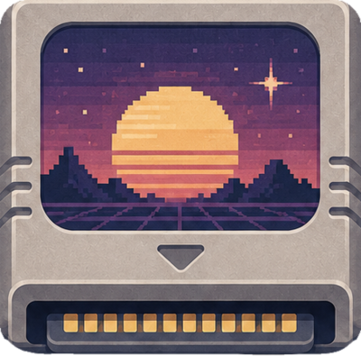
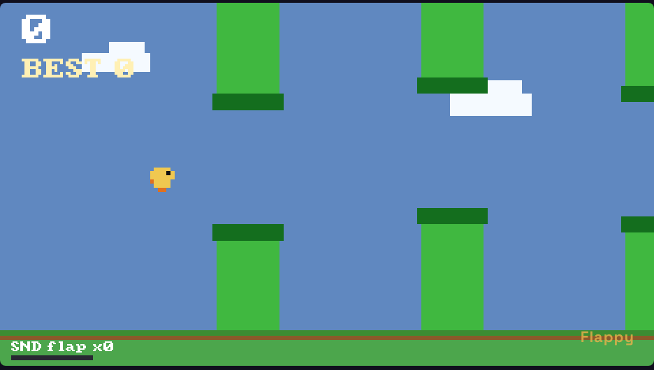
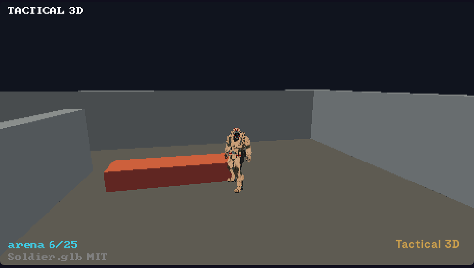

<p align="center">
  
</p>

<h1 align="center">DreamCart</h1>
<p align="center"><b>Self-contained game cartridges for tiny worlds.</b></p>

DreamCart is an **isomorphic** JavaScript game runtime — the *same* game `.js` runs
unchanged on Sony **PSP**, the **Web**, Nintendo **3DS**, and a dual-screen
**Android** handheld, powered by [QuickJS](https://bellard.org/quickjs/) (plus
[rust-psp](https://github.com/overdrivenpotato/rust-psp) on PSP and
[libctru/citro2d](https://github.com/devkitPro/libctru) on 3DS).

Each platform implements the same tiny native contract — `gfx.clear(r,g,b)`,
`gfx.fillRect(x,y,w,h,r,g,b)`, `log(msg)`, and a `frame(buttons)` function called
once per frame with a fixed controller bitmask — so games in
[`runtime/src/game/`](runtime/src/game/) are written once and run everywhere. An
**optional** `g3d` contract adds hardware-accelerated 3D the same way: meshes
uploaded once + one batched draw-list per frame, with all scene/physics/math logic
in shared JS and a native engine per platform (see
[`docs/3d-design.md`](docs/3d-design.md) and the `cube3d`/`racing3d`/`fps3d` games).

### Live

| | |
|---|---|
| 🎮 **Playground** | <https://dreamcart.games/play/> — run any game in a themeable handheld console, in your browser |
| 📖 **Docs** | <https://dreamcart.games/docs/> — architecture + lib API reference |
| 🗓 **Changelog** | <https://dreamcart.games/changelog/> — capability summaries by date |
| 🏠 **Home** | <https://dreamcart.games/> |

| Platform | Host | Graphics (2D / 3D) | Status |
|----------|------|--------------------|--------|
| PSP | Rust (rust-psp) + QuickJS | sceGu / sceGu+sceGum | ✅ runs (PPSSPP) |
| Web | Canvas + RAF | Canvas2D / WebGL2 | ✅ runs ([Playground](https://dreamcart.games/play/)) |
| 3DS | C (libctru) + QuickJS | citro2d / citro3d | ✅ runs (Azahar/hardware) |
| Android (dual-screen) | Kotlin + WebView (web engine) | Canvas2D / WebGL2 | ✅ runs (3DS-style handheld; top=game, bottom=native UI) — see [`android/`](android/) |

| Flappy (`flappy.js`) | Tactical 3D (`tatical3d.js`) |
|:---:|:---:|
|  |  |
| 2D framework game | 3D framework game (hardware-skinned glTF) |

## Games
There are two kinds of games, by naming convention:

- **`raw-*` — raw low-level demos.** Each is a single self-contained `.js` file
  that uses only the bare native contract (`gfx.clear`, `gfx.fillRect`, `log`, and
  a `frame(buttons)` loop; numbers drawn with a tiny rectangle pixel-font). They
  exist to exercise the low-level API directly, with no framework.
- **Unprefixed — framework games.** Authored against the framework (see
  [Framework](#framework-typescript-sdk-javascript-games) below) and bundled into
  the same runtime — including the 3D demos (`cube3d`, `racing3d`, `fps3d`,
  `skin3d`, `outdoor3d`, `bsp3d`, …) and a Jin-Yong-flavoured **wuxia village**
  story game (`rpg.js`).

The raw low-level demos live in [`runtime/src/game/`](runtime/src/game/):

| Game | File | Controls |
|------|------|----------|
| Snake (default) | `raw-snake.js` | D-pad steer; walls wrap; START restart |
| Pong | `raw-pong.js` | UP/DOWN move paddle (vs AI) |
| 2048 | `raw-g2048.js` | D-pad slide; START restart |
| Breakout | `raw-breakout.js` | LEFT/RIGHT paddle, CROSS launch |
| Tetris | `raw-tetris.js` | LEFT/RIGHT move, DOWN soft-drop, CROSS/UP rotate, START restart |
| Platformer | `raw-platformer.js` | LEFT/RIGHT run, CROSS jump, START restart |

Select which one to embed in a native build with `PSPJS_GAME`:

``` sh
PSPJS_GAME=raw-tetris.js bun run psp     # builds EBOOT.PBP for Tetris
```

Build every raw and framework game into a PSP memory-stick layout:

``` sh
bun run psp:all
# -> dist/psp/PSP/GAME/<game>/EBOOT.PBP
```

Copy `dist/psp/PSP` to the root of the PSP memory stick; each game appears as a
separate homebrew entry under `PSP/GAME/<game>/`. The script also packs each
EBOOT with a generated PSP menu title, `ICON0.PNG`, and `PIC1.PNG` placeholder
preview based on the game's `// @title`.

For real PSP/Vita startup debugging, build the trace EBOOT:

``` sh
bun run psp:trace
# -> dist/psp-trace/PSP/GAME/dreamcart-raw-snake-trace/EBOOT.PBP
```

On PS Vita Adrenaline, the final path is
`ux0:pspemu/PSP/GAME/dreamcart-raw-snake-trace/EBOOT.PBP`.

### Debug on real PSP hardware over USB
Run a freshly compiled game on an actual PSP in seconds — no memory-stick copy:

``` sh
bun run psp:hw walk3d   # build, then load onto the PSP; press Enter to hot-reload
```

It serves the cargo output to the PSP as `host0:` (usbhostfs) and `ldstart`s it
through PSPLINK (pspsh), keeping a tight edit → build → run loop on real silicon.
Needs a one-time host-tools + PSPLINK setup — see
[`docs/psp-hardware-debugging.md`](docs/psp-hardware-debugging.md).

## Play (one command)
`bun run play <web|psp|3ds> [game]` builds the chosen game and launches the
matching emulator:

``` sh
bun run play web              # open the Playground (pick a game from the list)
bun run play web maze         # Playground, jump straight to a game
bun run play psp raw-tetris   # build EBOOT + launch PPSSPP
bun run play 3ds rpg          # build .3dsx + launch a 3DS emulator (Azahar/Citra/…)
```

Run `bun run play` with no args to see the game list. PSP needs PPSSPP
(`brew install --cask ppsspp`); 3DS needs a 3DS emulator in `/Applications`.

## Framework (TypeScript SDK, JavaScript games)
The raw `gfx`/`frame` contract is deliberately tiny. On top of it lives a small,
**isomorphic** game framework ([`framework/`](framework/)) that runs the same on
**all platforms**. The SDK ([`framework/src/`](framework/src)) is written in
**TypeScript**, but games themselves are authored in **plain JavaScript** — the
project's firm boundary is that game business logic is JS. Games still get full
editor/CI type-checking via `// @ts-check` + JSDoc types imported from the SDK
(see [`framework/games/tsconfig.json`](framework/games/tsconfig.json)). Each game
is bundled (framework inlined) per platform, so PSP/Web/3DS execute identical code.

It provides: a scene/entity tree (`Scene`/`Node` with `update`/`draw`), the game
loop, edge-detecting `Input`, a seeded deterministic `Rng`, `Graphics`
(`rect`/`sprite`/`text`), palette `Bitmap`s with a baked **8×8 ASCII font** and
sprites, a `TileMap` with camera, a `DialogueBox`, a shared `CharController` +
analog input contract, an `ActionMap`, and data-driven scene descriptions. The 3D
stack adds the `g3d` contract, `Scene3D`, `mesh`/`material`/`light`/`skin`,
deterministic `math`, glTF hardware skinning, and a retained **native scene**
(cull + draw in Rust, not per-node QuickJS — the key PSP performance unlock).
Assets are *baked* to the binary [`.dcpak`](docs/dcpak-format.md) container
(`framework/bake/`). Full API: <https://dreamcart.games/docs/>.

## The web site & Playground
The site at **[dreamcart.games](https://dreamcart.games)** — home, Playground,
Docs and Changelog — is a static **Bun + React** multi-page app built into
`web/site/` and deployed to Cloudflare Pages. It uses a single CSS **token
contract** with **themes-as-data** (switched via `<html data-theme>`) and headless
components keyed by `data-part`, so one theme picker re-skins the whole site —
including the **handheld console** the Playground renders games inside (desktop:
horizontal, PSP-like; mobile: vertical, Game Boy SP-like). Four themes ship:
`cartridge` (default), `psp-silver`, `dmg` (Game Boy green), and `light`.

The Playground runs the *same* game files as every other platform: it implements
the identical `gfx`/`input`/`frame` contract on Canvas/WebGL2
([`web/engine.js`](web/engine.js), the global `window.PSPJS`) and loads the games
from a generated manifest ([`web/build-games.ts`](web/build-games.ts) →
`window.GAMES`). Each game's menu title, order and on-screen controls come from a
header comment in its own source (`// @title` / `// @order` / `// @controls`) — the
single source of truth, so adding a game needs no edit to the build script. Game
source is hidden by default behind a **Code** drawer (raw games stay editable +
runnable; framework games are read-only). Docs and Changelog are authored as
Markdown in [`web/content/`](web/content/) and rendered to static HTML at build
time (syntax highlighting via highlight.js, theme-recolored through tokens).

``` sh
bun run serve        # build + serve the full site -> http://localhost:8123
bun run site         # build the static site into web/site/
bun run deploy       # build + publish web/site/ to Cloudflare Pages
```

## Build & test
``` sh
bun install
bun run build          # bake assets -> typecheck -> bundle games -> web manifest
bun run test           # golden + smoke tests
```

`bun run build` bundles each `framework/games/*.js` (framework inlined, via
`Bun.build`) to `runtime/src/game/<name>.js`, so the PSP/Web/3DS build steps embed
them exactly like the raw demos (e.g. `PSPJS_GAME=rpg.js bun run psp`).

### Golden tests
`framework/test/golden.ts` renders each framework game's bundle **headlessly under
Bun** (a gfx mock → RGBA framebuffer), runs a deterministic seeded sequence with
scripted input, and byte-compares the framebuffer to a committed golden
(`framework/test/goldens/*.png`); it also runs a no-crash **smoke pass** over the
`raw-*` demos (seeded `Math.random`). A sibling
[`framework/test/contract.ts`](framework/test/contract.ts) asserts the controller
button bitmask is identical across the Web and 3DS hosts, the framework SDK, and
every raw demo's `BTN_*` constants (the raw games are eval'd as a string and so
can't `import` the canonical `Btn`, so the test enforces they never drift).
Because the same bundle runs on every platform, this catches crashes and visual
regressions in the shared code. Run with `bun run test`; regenerate goldens with
`UPDATE=1 bun framework/test/golden.ts`.

## Architecture
- **Rust host** (`runtime/src/main.rs`) owns the process: it sets up the GU
  (double-buffered 480x272), the controller, and a QuickJS runtime/context, then
  registers the native API and runs the per-frame loop (Rust opens the GE display
  list, calls JS `frame(buttons)`, then finishes/syncs/swaps).
- **2D graphics + input bridge** (`runtime/src/gfx.rs`, `runtime/src/bridge.rs`)
  exposes to JS:
  - `gfx.clear(r, g, b)`
  - `gfx.fillRect(x, y, w, h, r, g, b)`
  - `log(msg)`
  - `frame(buttons)` is defined by the game; `buttons` is the PSP controller bitmask
    (`UP=0x10`, `RIGHT=0x20`, `DOWN=0x40`, `LEFT=0x80`, `CROSS=0x4000`, `START=0x08`).
- **QuickJS allocator** (`runtime/src/qjs_alloc.rs`): QuickJS is created with
  `JS_NewRuntime2` so it allocates through the Rust/PSP allocator (rust-psp's
  startup sets up no C heap, so newlib `malloc` is unusable).
- **FFI bindings**: extended in `quickjs-rs/libquickjs-sys/src/lib.rs`.
- **Web host** (`web/engine.js`): the same `gfx`/`input`/`frame` contract on
  Canvas2D, with an optional WebGL2 layer for the `g3d` 3D pass.

## Setup (from a fresh clone, macOS)
Install [Bun](https://bun.sh) and [Homebrew](https://brew.sh) (and Docker, e.g.
[OrbStack](https://orbstack.dev), for the 3DS build), then one command sets up
**everything**:

``` sh
git clone https://github.com/doodlewind/dreamcart.git
cd dreamcart
bun install
bun run bootstrap
```

`bun run bootstrap` ([scripts/bootstrap.ts](scripts/bootstrap.ts)) is idempotent
and installs/configures:
- submodules (`bun run setup`)
- **LLVM** (`brew install llvm` — Apple clang can't target MIPS)
- **PPSSPP** (`brew install --cask ppsspp`) — PSP emulator
- **Azahar** (downloaded from GitHub releases) — 3DS emulator
- **Rust** `nightly-2026-05-28` + `rust-src` (pinned by `rust-toolchain.toml`)
- **cargo-psp / prxgen / prxmin / pack-pbp / mksfo** (installed from the pinned
  `pocket-stack/rust-psp` revision into the shared Pocket Stack cache)
- the checksum-verified **PSP SDK** from `pocket-stack/pspdev`
  (`sdk-noabicalls-normalized-2026-06-19`, with normalized archive metadata)
  into the shared Pocket Stack cache
- the **`devkitpro/devkitarm`** Docker image (3DS toolchain)

It reports anything it can't auto-install (Homebrew/Docker not present, Docker
daemon stopped); fix those and re-run. Then everything runs on Bun — there's no
Python/Make glue.

The pinned manifest is [`toolchains/psp.json`](toolchains/psp.json). DreamCart
and PocketJS both resolve it under
`${XDG_CACHE_HOME:-$HOME/.cache}/pocket-stack` (or `POCKET_STACK_CACHE_DIR`).
Set `PSP_SDK=/path/to/mipsel-sony-psp` to use an explicit SDK; `PSPDEV` is also
accepted for compatibility. An invalid explicit override is an error and never
silently falls through to the cache. The build exports both names to native
dependencies. Cached SDKs also carry a manifest-derived receipt, so an old
unverified `libc.a` directory cannot masquerade as the pinned download.

> The `quickjs-rs` and `rust-psp` submodules point at `pocket-stack/*` forks.
> Those forks carry DreamCart's PSP C/stdio shims, 32-bit `size_t` ABI/API
> exports, and PSP nightly/tooling compatibility fixes. LLVM `llvm-ar` is used
> for the static archive (Apple `ar` silently drops MIPS objects →
> `undefined symbol: JS_*`).
>
> The SDK tag is historical: QuickJS glue is compiled `+noabicalls` during the
> DreamCart build, while upstream prebuilt newlib remains `+abicalls`. The
> runtime suppresses that known linker warning by default; it does not claim
> that every library in the archive is no-abicalls.

## Run on PSP
Open the EBOOT in [PPSSPP](https://www.ppsspp.org/):

``` sh
open -a PPSSPPSDL --args runtime/target/mipsel-sony-psp/debug/EBOOT.PBP
```

## Run on the Web
``` sh
bun run serve        # -> http://localhost:8123  (PORT=3000 to change)
```

Open <http://localhost:8123/play/> (or `/play/?game=rpg.js` to pick one). The dev
server ([`web/serve.ts`](web/serve.ts)) builds the full site and serves it with
Cloudflare-Pages-style directory routing.

## Run on 3DS
Builds a `.3dsx` homebrew app using the `devkitpro/devkitarm` Docker image — no
host toolchain install or sudo needed (just Docker, e.g. OrbStack/Docker Desktop):

``` sh
PSPJS_GAME=raw-tetris.js bun run 3ds   # -> runtime-3ds/dreamcart-3ds.3dsx
```

Run the `.3dsx` in [Azahar](https://azahar-emu.org/) (the maintained Citra fork)
or on real hardware. The 3DS host ([`runtime-3ds/source/main.c`](runtime-3ds/source/main.c))
embeds QuickJS and renders the same games via citro2d (scaled to the 400×240 top
screen), with logs on the bottom screen.

## Run on Android (dual-screen)
A 3DS-style dual-screen handheld app (game on the top screen, native UI on the
bottom) that runs the **web engine** inside a WebView. See [`android/`](android/):

``` sh
bun run android          # assemble the debug APK
bun run android:install  # install + launch on a connected device/emulator
```

## License
MIT
